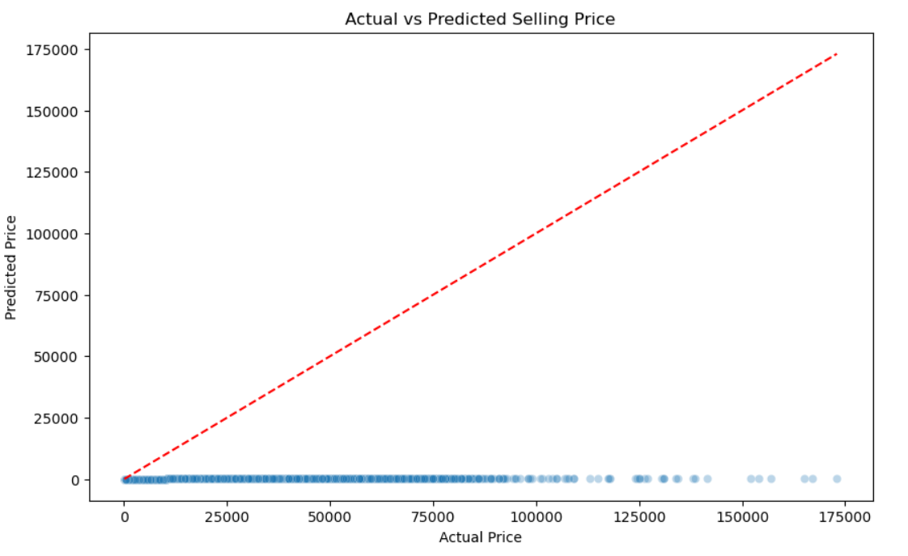
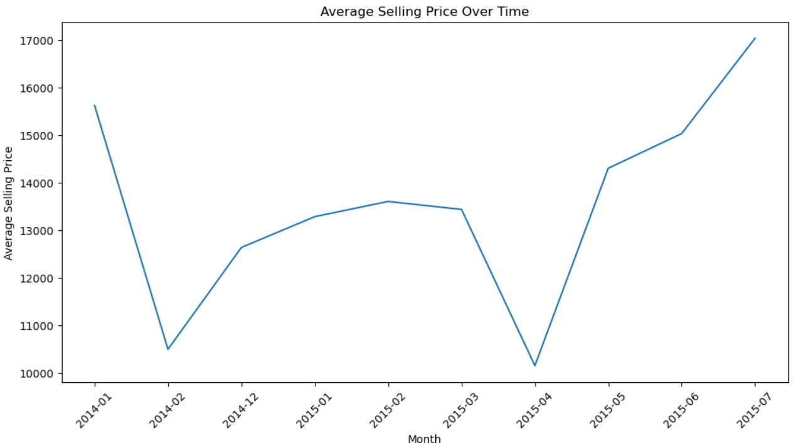

# 🚗 Car Price Prediction Using Linear Regression

A practical, machine learning project to estimate selling prices of used cars based on condition, mileage, location, and other factors. Created using Python and Jupyter Notebook, it reflects core strengths in data cleaning, visualization, and regression modeling.

This project is part of my professional portfolio as a Business Analyst, showcasing my ability to extract insights from real-world datasets and build predictive tools that support decision-making.

---

## 📌 Key Highlights

- 🧹 Data cleaning and preprocessing  
- 📊 Visual exploration of pricing trends  
- 📈 Linear Regression model built and evaluated using R², MAE, and RMSE  
- 🖼️ Charts included to highlight model performance and key relationships  

---

## 💻 Tech Stack


---

## 🖼️ Sample Visuals

> *Add these once visuals are pushed to GitHub*

```markdown


